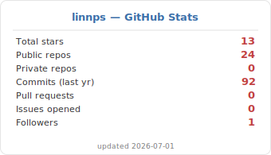
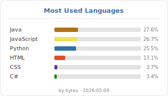
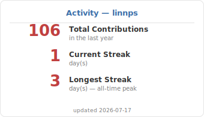
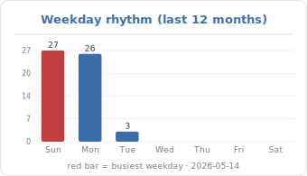
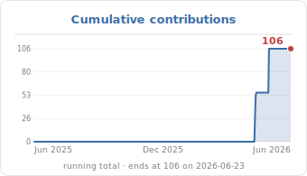
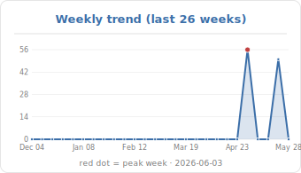
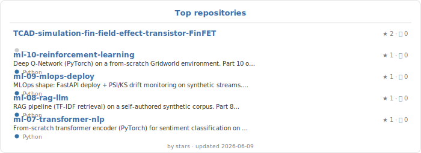
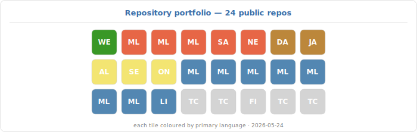

### Purdue PhD · UIUC CS · several years of engineering experience

---

## 👋 About

Engineer with a research-science background — a Purdue PhD followed
by graduate CS work at UIUC — and a multi-year track record of
shipping ML and engineering systems in industry. The repos linked
here put that experience to a different use: distilling the canonical
machine-learning curriculum into a series of small, well-instrumented
**reference implementations** that other people can read, run, and
modify.

Each one picks a single canonical topic, strips it down to its
essential moving parts, and explains it through code and
visualizations rather than equations and prose.

> 🔭 &nbsp;**Currently** — turning the major branches of ML into reference projects, one repo per topic
>
> 🛠️ &nbsp;**Background** — research science · applied ML engineering · production systems · technical mentoring
>
> ⚡ &nbsp;**Approach** — synthetic data with known ground truth · code that reads like an explanation · dashboards designed to be scanned in 30 seconds
>
> 💬 &nbsp;**Useful for** — anyone who wants a particular ML concept implemented end-to-end, without the usual benchmark-fetishism

These projects are deliberately small. The goal isn't state-of-the-art
numbers — it's to make every step of a working ML pipeline **visible,
modifiable, and teachable**. If they help someone go from *"I've read
the paper"* to *"I can build it from scratch,"* they've done their job.

---

## What's in the repo list

A reference set covering the major branches of machine learning —
one project per topic, each one self-contained and built to the
same recipe so the boilerplate is invisible and the *content* is
what stands out:

- A synthetic data generator with a **known generative process** — so models can be evaluated against the *truth*, not just a holdout score
- A from-scratch implementation in PyTorch or scikit-learn — minimal dependencies, readable top-to-bottom
- A dashboard-style README with embedded charts in a unified palette
- A *"What I learned"* reflection at the end — not a metrics dump

<table>
<tr>
<th align="left">Topic</th>
<th align="left">Demonstrated skills</th>
</tr>
<tr><td><a href="https://github.com/linnps/ml-01-linear-regression"><b>Supervised — regression</b></a></td>
<td>OLS · Ridge · Lasso · coefficient-recovery diagnostics</td></tr>
<tr><td><a href="https://github.com/linnps/ml-02-classification-tree"><b>Supervised — classification</b></a></td>
<td>Logistic · Decision Tree · Random Forest · Gradient Boosting</td></tr>
<tr><td><a href="https://github.com/linnps/ml-03-clustering"><b>Unsupervised — clustering</b></a></td>
<td>K-means · DBSCAN · Agglomerative · ARI vs Silhouette</td></tr>
<tr><td><a href="https://github.com/linnps/ml-04-pca-tsne"><b>Unsupervised — dim reduction</b></a></td>
<td>PCA · t-SNE · trustworthiness · scree plots</td></tr>
<tr><td><a href="https://github.com/linnps/ml-05-cnn-image-classification"><b>Deep learning — vision</b></a></td>
<td>CNN from scratch · PyTorch · synthetic image rendering</td></tr>
<tr><td><a href="https://github.com/linnps/ml-06-rnn-lstm-timeseries"><b>Deep learning — sequence</b></a></td>
<td>LSTM · time-series forecasting · seasonal-naive baselines</td></tr>
<tr><td><a href="https://github.com/linnps/ml-07-transformer-nlp"><b>Deep learning — NLP</b></a></td>
<td>Transformer encoder from scratch · attention visualization</td></tr>
<tr><td><a href="https://github.com/linnps/ml-08-rag-llm"><b>Modern AI — LLM</b></a></td>
<td>RAG · vector retrieval · refusal-threshold tuning · hallucination measurement</td></tr>
<tr><td><a href="https://github.com/linnps/ml-09-mlops-deploy"><b>Production / MLOps</b></a></td>
<td>FastAPI · Docker · PSI / KS drift monitoring · latency probing</td></tr>
<tr><td><a href="https://github.com/linnps/ml-10-reinforcement-learning"><b>Reinforcement learning</b></a></td>
<td>DQN · replay buffer · target network · ε-greedy schedule</td></tr>
</table>

---

## 🎮 Live · [Algorithm Playground](https://linnps.github.io/algorithm-playground/)

> **[linnps.github.io/algorithm-playground/](https://linnps.github.io/algorithm-playground/)**

Interactive CS algorithm visualizations — sorting, pathfinding, graphs,
trees, dynamic programming, and more. Pure HTML / CSS / JS, no build
tooling, runs entirely in the browser.

The complement to the ML portfolio above: where those repos demonstrate
model-building from scratch, this site shows algorithmic thinking from
scratch. Same blue / red / gray palette, same "boring code, sharp
insights" philosophy. Currently 1/10 algorithms live (sorting), 9 in
the queue.

[**Source on GitHub**](https://github.com/linnps/algorithm-playground)

---

## Other repositories

A short tour of the older public repos on this profile — they pre-date
the current ML focus and span device-physics simulation, deep-learning
research, full-stack web services, a desktop application, and IoT /
robotics. Together they show the breadth of programming work behind the
ML reference set above.

### Semiconductor device simulation — TCAD (Silvaco Athena/Atlas)

Numerical simulations of canonical device structures: process flow,
electrostatic field, carrier concentration, and IV-curve sweeps —
rendered for each device type.

- [TCAD — Diode](https://github.com/linnps/TCAD-Simulation-Diode)
- [TCAD — MOSFET](https://github.com/linnps/TCAD-Simulation-MOSFET)
- [TCAD — BJT](https://github.com/linnps/TCAD-Simulation-Bipolar-Junction-Transistor-BJT)
- [TCAD — FinFET](https://github.com/linnps/TCAD-simulation-fin-field-effect-transistor-FinFET)

> **Skills demonstrated:** semiconductor device physics · process / device simulation · electrostatic & carrier-transport solvers · IV-curve interpretation

### Deep-learning research

- [**Heart-failure risk prediction (DG-RNN on MIMIC-III)**](https://github.com/linnps/DLH_Team38_Final) — Domain-Knowledge-Guided Recurrent Neural Network with knowledge-graph features, comparing against standard EHR risk-prediction models. PyTorch + PyHealth. Coursework for *Deep Learning for Healthcare* (UIUC CS 598).

> **Skills demonstrated:** PyTorch · RNN / GRU on irregular time-stamped sequences · knowledge-graph integration · PyHealth · clinical EHR data handling

### Web / backend services

- [**RESTful API from scratch**](https://github.com/linnps/Self-made-RESTful-API) — Express + MongoDB; full GET / PUT / PATCH / DELETE article CRUD; tested via Postman.
- [**Online to-do list service**](https://github.com/linnps/Online-to-do-list-service) — Node.js + MongoDB on Heroku, with per-user collections and weather / location enrichment.
- [**Newsletter sign-up service**](https://github.com/linnps/Newsletter-Online-Sign-Up-Service) — Node.js + MailChimp on Heroku.

> **Skills demonstrated:** Node.js · Express · REST API design · MongoDB · third-party API integration · cloud deployment

### Desktop application

- [**Web Browser — three-tier C# desktop app**](https://github.com/linnps/Web-Browser-three-tier-graphical-event-driven-desktop-application) — Object-oriented event-driven browser with bookmark / history managers backed by SQL. Built incrementally from a single button to a full multi-tab application.

> **Skills demonstrated:** OOP · C# / WinForms · event-driven UI · multi-tier architecture · SQL persistence

### IoT / robotics

- [**Self-driving car — environment scanning + autonomous driving**](https://github.com/linnps/iot-sp2022-lab1) — Lab for *IoT Systems* (UIUC CS 437). Mapping the local environment and driving around obstacles.

> **Skills demonstrated:** IoT pipelines · sensor data processing · simple autonomous control loops

---

## Stack

**Comfortable with**
&nbsp;&nbsp; `Python` &nbsp;·&nbsp; `PyTorch` &nbsp;·&nbsp; `scikit-learn` &nbsp;·&nbsp; `pandas` &nbsp;·&nbsp; `NumPy` &nbsp;·&nbsp; `matplotlib` &nbsp;·&nbsp; `FastAPI` &nbsp;·&nbsp; `Docker` &nbsp;·&nbsp; `Git`

**Working knowledge**
&nbsp;&nbsp; `SQL` &nbsp;·&nbsp; `Bash` &nbsp;·&nbsp; `JavaScript / TypeScript` &nbsp;·&nbsp; `Hugging Face transformers` &nbsp;·&nbsp; `Linux`

---

## Principles these repos are written to

> *"Synthetic data first.  Dashboards over benchmarks.  Boring code, sharp insights.  Always end with what was learned."*

- **Synthetic data first.** When the generative process is known, models can be evaluated against the *truth*, not just a holdout number. Coefficient recovery, ground-truth ARI, theoretical noise floors — diagnostics that benchmark datasets cannot offer.
- **Dashboards over benchmarks.** Every project ends with figures a reader can scan in 30 seconds, not a single F1 score buried in a table.
- **Boring code, sharp insights.** Code prioritizes clarity over cleverness. The interesting part lives in the analysis and visualizations, not in the lines themselves.
- **Reflection beats reporting.** Metrics describe what happened. *"What I learned"* sections describe what I would do differently next time — and that's the part worth keeping six months later.

---

## Stats & Activity

<table>
<tr>
<td align="center"></td>
<td align="center"></td>
</tr>
<tr>
<td align="center"></td>
<td align="center"></td>
</tr>
<tr>
<td align="center"></td>
<td align="center"></td>
</tr>
</table>

 

 

All nine cards are **self-generated** by [`scripts/generate_cards.py`](./scripts/generate_cards.py) on a daily GitHub Action ([workflow](./.github/workflows/update-cards.yml)) that calls the GitHub GraphQL API and renders SVGs in the portfolio palette. No third-party stats service in the loop — no `DEPLOYMENT_PAUSED` outages, no profile data sent to anyone else's server, and any colour or layout can be changed by editing one Python file.

---

Palette: <code>#3B6EA8</code> blue · <code>#C04040</code> red · <code>#7A7A7A</code> gray · <code>#E5E5E5</code> light gray · <code>#FFFFFF</code> white &nbsp;·&nbsp; the same one used across every project.

